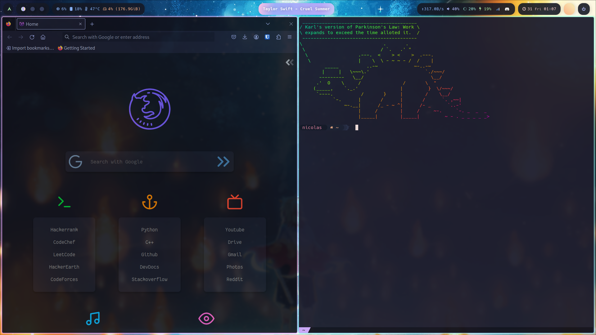
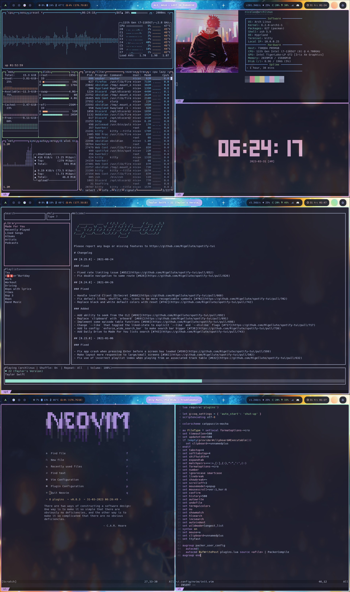
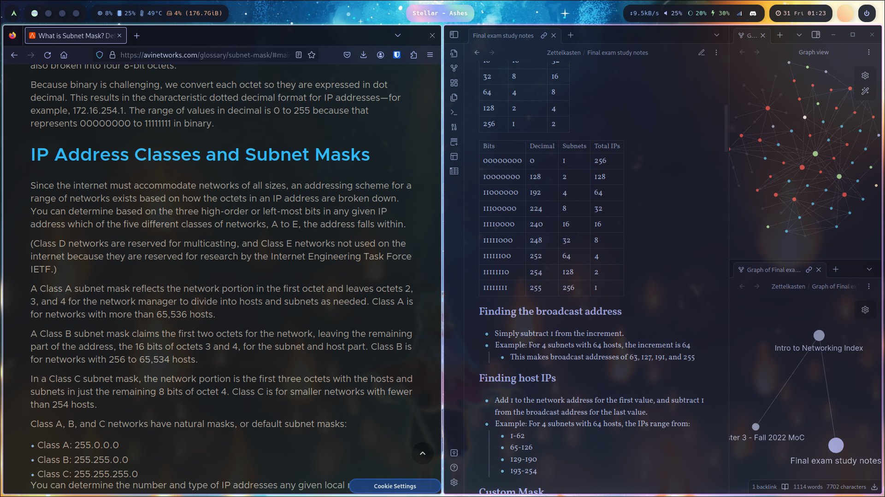
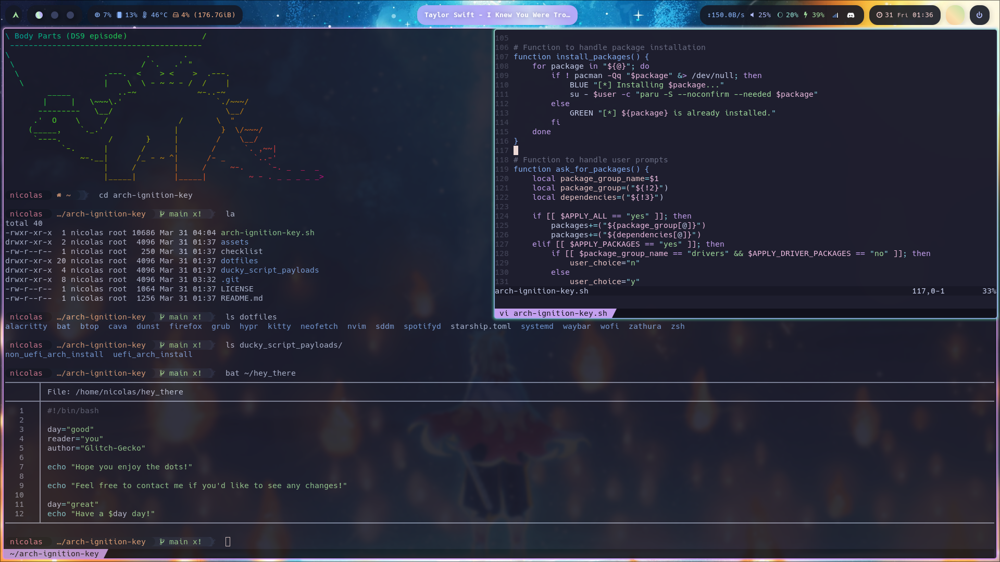
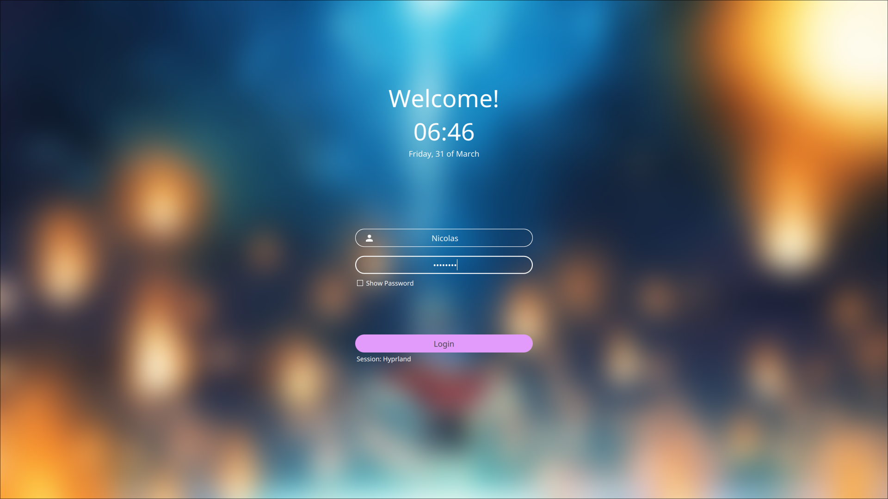
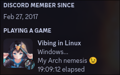

<div align="center">

 
### Glitch-Gecko's Arch Ignition Key
 <h6 align="center">
  <a href="https://github.com/Glitch-Gecko/arch-ignition-key#Screenshots">Screenshots</a>
  ·
  <a href="https://github.com/Glitch-Gecko/arch-ignition-key#Features">Features</a>
  ·
  <a href="https://github.com/Glitch-Gecko/arch-ignition-key#Installation">Installation</a>
</h6>
 
---
 

</div>



```mint
⠀⠀   🚀 Arch Ignition Key Setup 🚀
 --------------------------------------

 ╭─ Distro          -> Arch Linux x86_64
 ├─ Window Manager  -> Hyprland
 ├─ Terminal        -> Kitty
 ├─ Browser         -> Firefox
 ├─ Shell           -> Oh-My-ZSH
 ╰─ Resource Monitor -> Btop

 ╭─ Editor     -> Neovim
 ├─ Notes      -> Obsidian
 ├─ Font       -> Hack Nerd Font
 ├─ Taskbar    -> Waybar
 ├─ Bootloader -> Grub
 ├─ Lockscreen -> SDDM
 ├─ Chat       -> Discord
 ├─ Startup    -> Plymouth
 ├─ Music      -> Spotify-tui
 ╰─ Launcher   -> Wofi

   ⚙️   🌐   🚀   💻   🎶   📚   🖼️   🌈
```

<details open>
<summary><h2>Screenshots</h2></summary>




</details>

---

<details open>
<summary><h2>Features</h2></summary>


- Comprehensive window manager setup
- Minimalist and focused design
- Custom hotkeys and window rules
- Streamlined notetaking and development
- Git integrations
- Custom firefox and discord themes
- Wifi, bluetooth, and audio GUIs
- Wallpaper switching
- Customizable dotfiles
- Duckyscript for Archiso
- Automated setup process
- Unique startup experience
- *Blazingly* fast system
- Discord rich presence
</details>

---

<details open>
<summary><h2>Installation</h2></summary>

```sh
git clone https://github.com/ainchentmew2/arch-ignition-key
cd arch-ignition-key
sudo ./arch-ignition-key.sh -a
```

</details>

<div align="center">

### Enjoy!</div>

---

<details>
<summary><h2>Credits</h2></summary>

- [r/unixporn](https://www.reddit.com/r/unixporn) - For inspiration and guidance

- [Arch wiki and its maintainers](https://wiki.archlinux.org) - For outstanding documentation and references
  
- [Chat GPT](https://chat.openai.com) - For help with oddly specific issues
 
</details></div>
  
---
  
<div align="center">

### *Thank you for using my Arch Ignition Key! Have fun with your new setup!*
</div>
