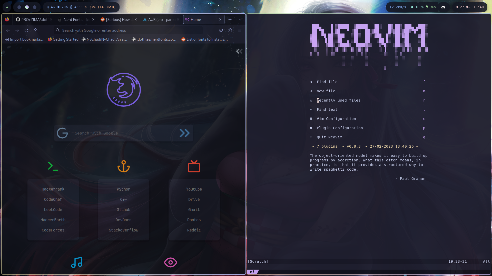
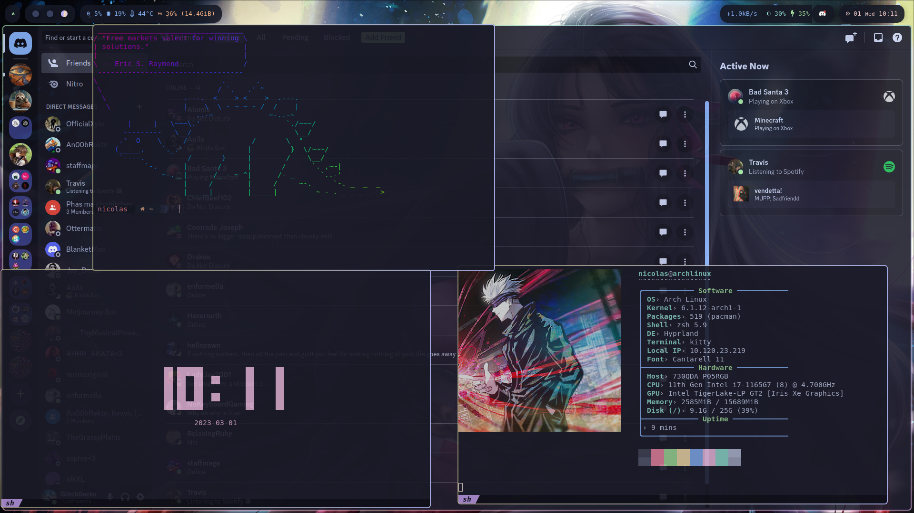
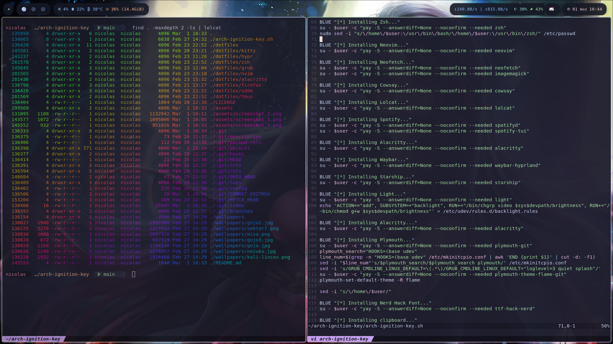
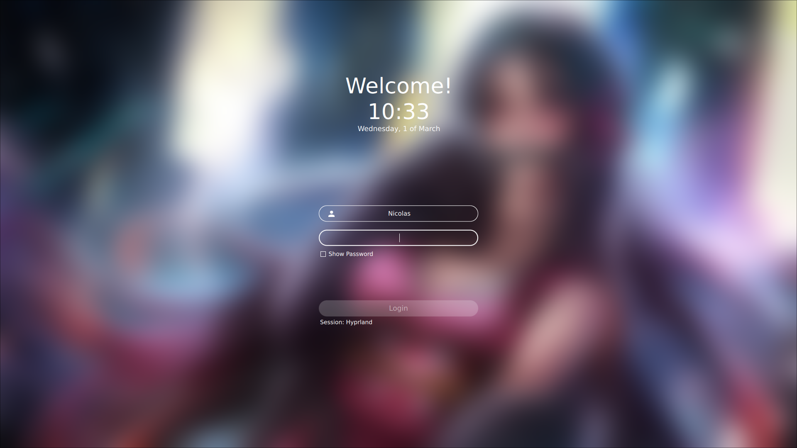
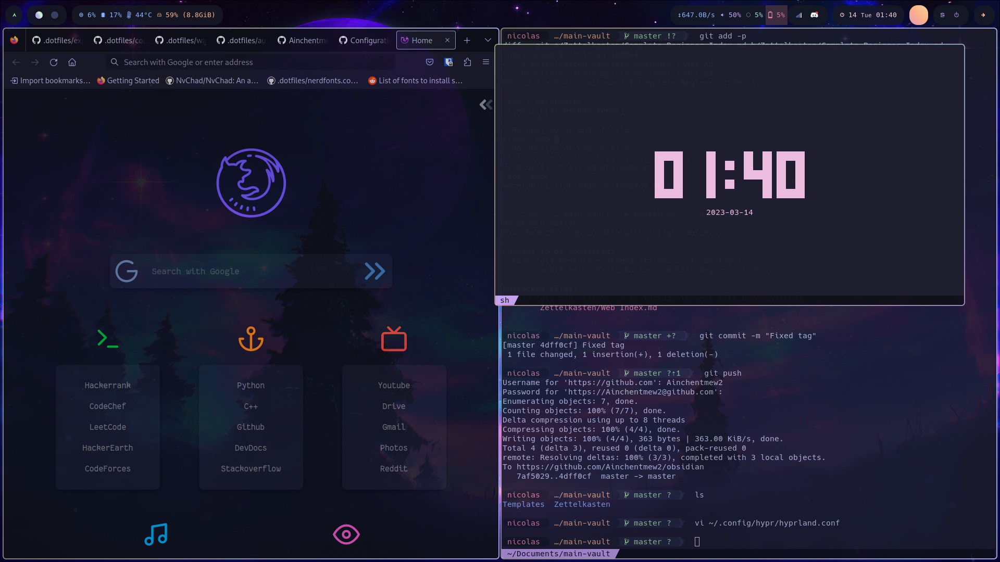
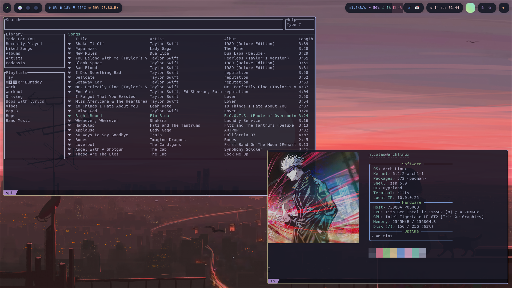
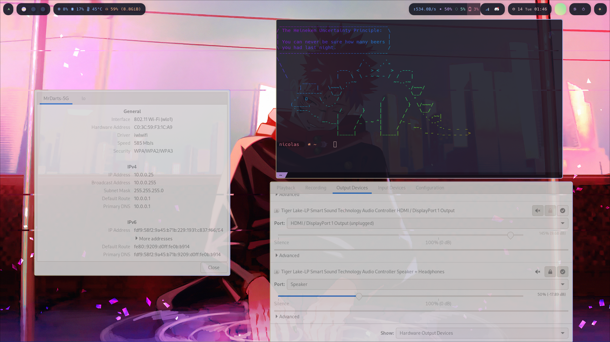

<div align="center">

# Arch Ignition Key

Scripts and dotfiles to automate the setup of a fresh Arch Linux install easily, with my custom configuration

</div>

### Configuration

```
WM                  Hyprland
Terminal            Kitty
Theme               Catppuccin
Browser             Firefox
Shell               ZSH
Editor              Neovim
Font                Hack Nerd Font
Taskbar             Waybar
Chat                Discord
Music               Spotify-tui
Fetch               Neofetch
Lockscreen          Sddm
SDDM theme          Sugar Candy
Boot loader         Grub
Grub theme          Sleek
Startup animation   Plymouth
```

### Screenshots









---

### Installation
```sh
git clone https://github.com/ainchentmew2/arch-ignition-key
cd arch-ignition-key
sudo ./arch-ignition-key.sh
```
<div align="center">

#### Enjoy!

</div>

---

### Credits

[r/unixporn](https://www.reddit.com/r/unixporn)

[Arch wiki](https://wiki.archlinux.org)
