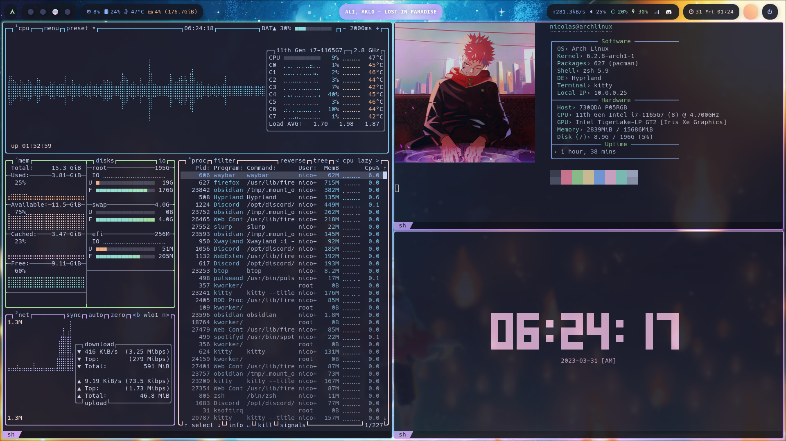
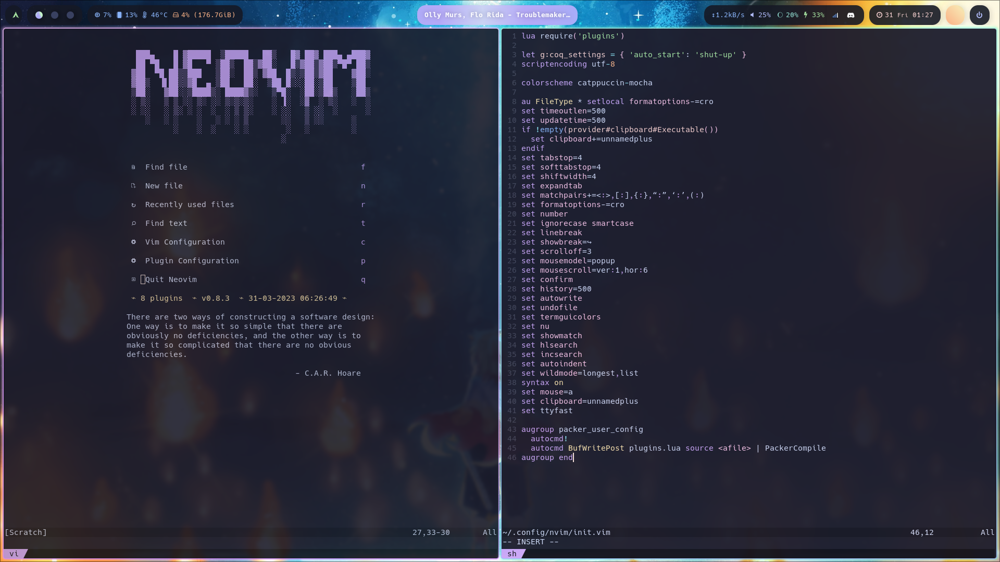
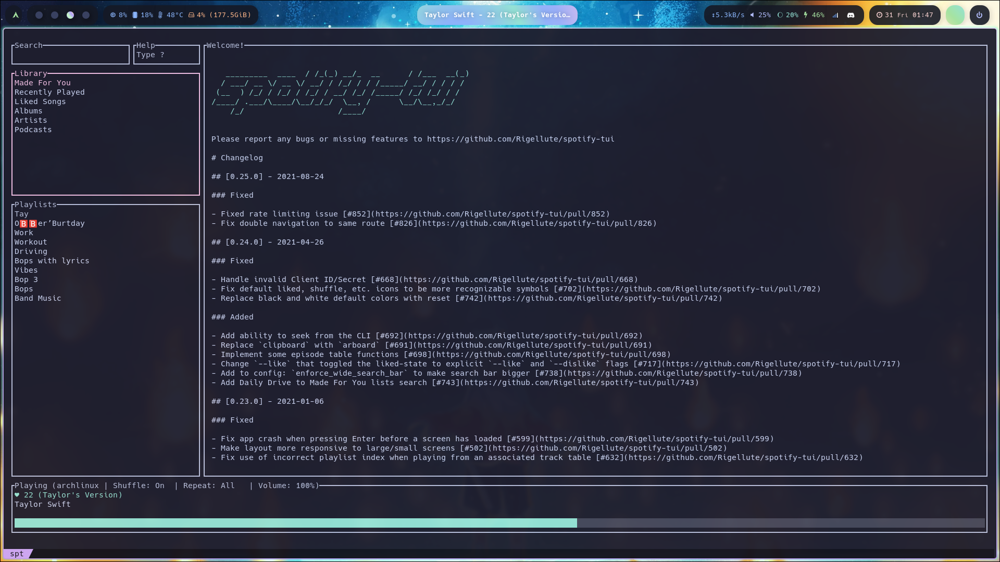

<div align="center">

# Arch Ignition Key

Scripts and dotfiles to automate the setup of a fresh Arch Linux install easily, with my custom configuration

</div>

### Configuration

```
WM                  Hyprland
Terminal            Kitty
Theme               Catppuccin
Browser             Firefox
Shell               Oh-My-ZSH
Editor              Neovim
Notes               Obsidian
Font                Hack Nerd Font
Taskbar             Waybar
Chat                Discord
Music               Spotify-tui
Fetch               Neofetch
Top                 Btop
Lockscreen          Sddm
SDDM theme          Sugar Candy
Boot loader         Grub
Grub theme          Sleek
Startup animation   Plymouth
Pdf viewer          Zathura
Launcher            Wofi

... and many more!
```

### Screenshots








---

### Features
- Fully fleshed-out window manager
- Non-distracting design
- Custom hotkeys and window rules
- Easy notetaking and development
- Git integrations
- Custom firefox and discord themes
- Wifi, bluetooth, and audio GUIs
- Wallpaper switching
- Customizable dots
- Duckyscript for archiso
- Automated setup
- Unique startup
- *Blazingly* fast
- Discord rich presence

---

### Installation
```sh
git clone https://github.com/ainchentmew2/arch-ignition-key
cd arch-ignition-key
sudo ./arch-ignition-key.sh -a
```
<div align="center">

#### Enjoy!

</div>

---

### Credits

[r/unixporn](https://www.reddit.com/r/unixporn)

[Arch wiki](https://wiki.archlinux.org)

[Chat GPT](https://chat.openai.com)
